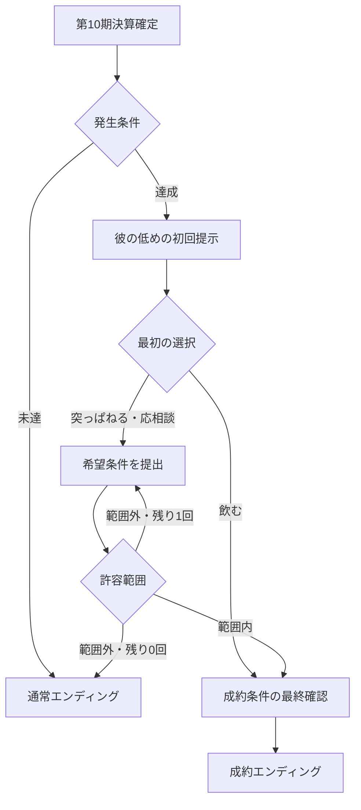

# 資本主義の権化〜財務で遊ぼう〜 統合仕様書

版：2026-09-30 JST／現行公開v33＋多角化・M&A設計案  
改訂：rev2（2026-09-29 ちぬ回答を反映。変更箇所は 3、8.5、8.7、9、10.1、10.8、11.4、12〜14 と下の「rev2の変更点」）  
用途：別の実装担当者への引き継ぎ、仕様レビュー、未整理事項の決定  
現行サイト：https://capitalism-finance-game-prototype.riskyedge7366.chatgpt.site  
現行ソース：`e00728ce831e82f33dd5578948d74c66952aca5d`

## rev2の変更点（2026-09-29 ちぬ決定）

| 項目 | 決定 | 反映先 |
|---|---|---|
| 消費税 | 現行の10%税抜経理を維持。多角化は割り切る（住宅家賃は非課税、事務所家賃と漁獲物は一律10%、仕入税額控除の按分はしない） | 8.7、9.2 |
| 企画の柱 | スコア・ランキング、ごまかしコマンドと税務調査の指摘パターン、法人税ゲージ・生活費ゲージ、巡航は書き漏れ。実装対象 | 14章（新設） |
| M&A | 売却代金は個人資産に入り、個人資産の点数が跳ね上がる「最後のボーナスチャレンジ」 | 10.1、10.8、14.2 |
| 2店舗目 | 作らない。事業別収支（釣具店・漁業・投資不動産）だけ | 11.4 |
| 従業員の上限 | 部門ごと。投資不動産は外部管理で従業員不要 | 3章 |
| 不動産融資 | 耐用年数に応じて柔軟に（設備資金の最長10年とは別の不動産融資） | 8.5 |

## 0. この文書の読み方

| 表記 | 意味 | 実装担当者の扱い |
|---|---|---|
| 実装済み | v33のソース・検証記録で確認 | 変更依頼のない既存挙動を保持 |
| 要求確定・未実装 | ユーザーが指定した内容 | 次の実装で満たす |
| 提案・要調整 | 未指定部分に対する設計案 | ユーザー決定と混同しない。採用時に数値とルールを確定 |
| 未決定 | ゲーム結果・会計・操作を左右する未整理事項 | 勝手に別仕様で埋めず、決定表に沿って整理 |
| 検証待ち | 機能はあるが確認を残す | 未実装と混同しない |

**この文書を作成した時点で、漁業・投資不動産・M&Aは公開版に存在しない。** 過去の「主要機能は実装済み」という説明から多角化が漏れていたため、ここで残課題として明示する。過去の日付の仕様書・各版の変更記録には古い金額・未実装一覧が含まれる。現行仕様は本書第1〜7章と指定コミットを優先する。

第8章以降は将来仕様。数値の例は市場実測値・実際の融資承認基準ではなく、ゲーム調整用の候補値である。

## 1. ゲームの目的・進行【実装済み】

- 釣具店の経営判断を通じ、仕訳、B/S、P/L、利益と預金の差、銀行審査、納税を学ぶ。
- 主人公・経営者はクエ。セリフは関西弁。登場人物の画像はユーザーのチヌクエスト２を出典とする。
- 会社と社長個人の財布を分離。初期はクエ1人、従業員なし。
- 1ターン＝1か月。4月開業・翌3月決算。現行は最大120か月＝10年。会社預金または生活費未充足により終了する。
- 月次の行動は原則1つ。採用・設備投資はその月の行動を使用。資料閲覧・比較試算・役員借入金返済・バイトからの登用は行動もターンも使わない。
- 店番、販促・接客改善、営業・協賛などが接客人数・費用・遅れて現れる集客効果に影響する。
- 未確定月に仕入・価格・行動を選び、月次確定で売上・費用・税金・資金増減を処理。初経験の仕訳演出後に月次報告を表示。
- 3ターンごとのぼやきは、冬・売上・営業不足・常連などの実際の状況に合わせる。

### 1.1 開業と初学者向け説明

株式払込、差入保証金、開業備品、初期商品を段階的に計上。最初から完成後の残高だけを見せない。クエの起業の動機は、麻雀で貯めた資金から会社を始める設定。

| 取引 | 借方 | 貸方 | 現行金額・扱い |
|---|---|---|---|
| 株式払込 | 預金 | 資本金 | 1,000万円 |
| 店舗保証金 | 差入保証金 | 預金 | 30万円。費用ではなく資産 |
| 開業備品 | 什器 | 預金 | 税抜120万円＋仮払消費税等。60か月償却 |
| 初期商品 | 商品 | 預金 | 商品別数量×税抜原価＋仮払消費税等 |

初年度12か月の教材で、現金仕入とカード回収2か月後のズレ、粗利、夏の過剰仕入、冬の資金不足、品揃え、遅れる販促、会社と個人の分離、借入、決算を説明する。

B/Sは「**基準日**の会社の資産・負債・純資産」。P/Lは「**1年間**の成績表」と説明し、月次P/Lでは当月・年度累計の違いを明示。「作成日」を基準日の意味で使わない。

試算表は仕訳を科目ごとに集計した確認表。毎月の積み上げと決算整理を経て年次決算書・税務申告につながると説明する。単に12枚を並べるだけで申告が完了すると誤解させない。

## 2. 商品・店舗・経営バランス【実装済み】

### 2.1 商品

価格・原価は税抜。基本粗利率は定価時の `(単価−原価)÷単価`。商品カードには選択した価格・仕入数量・季節・行動に基づく見込み月間売上・粗利も表示する。

| 商品 | 原価 | 定価 | 初期数量 | 解放・劣化 |
|---|---:|---:|---:|---|
| 仕掛け・糸 | 330円 | 550円 | 2,000 | 18か月で陳腐化 |
| 常温エサ | 275円 | 550円 | 1,100 | 6か月期限 |
| 竿 | 22,500円 | 30,000円 | 3 | 24か月で陳腐化・固定価格 |
| ルアー | 780円 | 1,200円 | 60 | 12か月で陳腐化 |
| リール | 40,000円 | 50,000円 | 3 | 30か月で陳腐化・固定価格 |
| 冷凍エサ | 300円 | 650円 | 0 | 冷凍庫で解放、3か月期限 |
| 活きアジ | 80円 | 220円 | 0 | 生け簀で解放、販売前に月5％死亡 |

ウェアは販売対象外。旧セーブ互換用の内部枠だけ残し、既存旧在庫は所定の移行処理で原価返品する。一般の商品返品機能ではない。

- 仕入は税込の当月預金払い。数量は非負整数、予算・保管量・必要設備を検証する。
- 仕入時に商品資産、販売時に売上原価へ振替。仕入代金を直ちに全額費用としない。
- FIFOロットで入荷時期を保持。廃棄は商品廃棄損／商品。預金をもう一度減らさない。
- 竿・リールはカード決済。高額商品1点につき販売済み消耗品各種最大1点を同じカード会計に割当。販売数・売上を水増ししない。
- カード売上は税込売掛金を計上、2か月後に預金／売掛金で回収。売上や仮受消費税を二重計上しない。

### 2.2 設備

| 設備 | 税抜取得額 | 月維持費 | 償却月数 | 主な用途 |
|---|---:|---:|---:|---|
| 倉庫 | 300万円 | 1万円 | 120 | 常温保管拡張・集客上限増 |
| 冷凍庫 | 150万円 | 3万円 | 60 | 冷凍エサ解放・600パックまで |
| 生け簀 | 250万円 | 3万円 | 60 | 冷凍庫が前提、活きアジ300匹まで |
| 接客什器 | 150万円 | 0円 | 72 | 店番がいる月の接客上限＋350人 |

設備の売却・買替・廃止などの見直し機能は今回の要求対象外。多角化の資産追加と、既存設備の再設計を混同しない。

### 2.3 季節・努力・品揃え

- 季節係数（4月→3月）：1.02、1.04、1.15、1.40、1.50、1.45、1.35、1.12、0.55、0.40、0.48、0.95。
- 春は普通、夏〜秋に伸び、冬に大きく落ちる。夏の売上をそのまま冬の仕入に延長すると廃棄・資金不足になり得る。
- 販促・接客改善は追加税抜3万円、営業・協賛は20万円。効果は4か月後から6か月に配分。販売実績のあるセールは翌年同時期にも効果。
- 解放済み全種類の月末在庫があれば、品揃え由来の自然減はゼロ。種類が欠けるほど自然減が大きい。
- 3年目から別枠の営業不足による低下を適用。9か月超努力を怠ると、経過年数・放置期間に応じて集客と常連が減る。
- 過去の営業効果、販売、品揃えがそろう月に常連が育つ。常連により需要の振れ幅が小さくなり、高額商品等の購入が増える。現在の努力が即座に全効果になる仕様ではない。
- 目標バランスは普通の経営で1〜2年目赤字、3年目以降黒字化。シビアな選択なら初年度ぎりぎり黒字も可能。年▲150万円・▲50万円は目安で、全乱数系列の保証値ではない。

## 3. 人員・社長個人資金【実装済み】

| 職種 | 月給 | 接客力 | 社会保険の会社負担 |
|---|---:|---:|---:|
| クエ | 役員報酬設定による（標準30万円） | 店番1,000人 | 給与の15％というゲーム概算 |
| 店長 | 35万円 | 1,200人 | 同上 |
| 社員 | 25万円 | 800人 | 同上 |
| バイト | 12万円 | 400人 | このゲームでは加算なし |

従業員の上限は部門ごと（rev2 ちぬ決定）：釣具店3人、漁業は船1隻につき船長1人＋船員2人まで、投資不動産は外部管理委託で0人。同じ人を複数部門に同時配置しない。新規採用月は接客力半分、給与は満額。接客改善中のクエは通常接客力の80％、営業・採用・投資等ではクエの店番はなし。

**要確認の既存差分：** 過去の希望「クエの接客力が最高」に対し、現行はクエ1,000・店長1,200で逆転している。本書作成では変更していない。次回調整でクエを最高に戻すか、バランスへの影響とともに確認する。旧仕様書の1,500人を現行値と誤記しない。

### 3.1 登用・退職

- 採用から24〜47か月のいずれかで相談。時期は採用時に決め保存し、再読込で変えない。
- 相談後は保留可能。勤続48か月の月初までに登用しないと退職。
- 登用で人数は増えず、勤続を引継ぐ。月給25万円＋会社社保3万7,500円。バイト時より月16万7,500円増を確認画面に表示。
- バイト出身社員は外部採用より集客・事務能力が高い。画面に能力の数値は出さない。
- 内部実装値：社員集客補正は外部1％・内部4％、合計15％上限。内部社員は雑費税抜8,000円／人削減、24,000円上限。資料不備抑制は内部80％、外部社員・店長30％。
- 古いセーブの期限超過者には、移行後少なくとも1つの未確定月で登用を判断できる猶予を与える。

### 3.2 社長の財布

- 個人生活費が足りないと会社から役員貸付。会社の資産だが銀行審査では強く減点・損失補正する。
- 約定利息は未収利息／受取利息、回収は預金／未収利息。現行ゲーム利率は年1.3％。元本回収を利益にしない。
- 社長から会社へ貸すと預金／役員借入金。帳簿上は負債、銀行分析では自己資本に加算。
- 会社から社長への役員借入返済は、現在残高の3割・5割・全額。未確定月にターン・行動非消費。会社預金と負債が減り、個人預金が増える。利益は変わらない。
- 部分返済は円未満切捨て。返済後預金・残高・個人預金を確認してから実行する。

## 4. 財務諸表・銀行【実装済み】

### 4.1 財務諸表

- B/Sは左に資産、右に負債・純資産。流動・固定、小計・合計を表示。
- 科目・金額・増減の対応を保ち、＋／▲の独立列を設ける。試算表は前月末比、決算書は前年比。
- 4月のB/Sも3月末の確定残高と比較する。年度損益の振替前後を混在させない。
- 月末はゲーム画面に重ねて表示。「決算書」等のメニューからいつでも参照。
- 連続決算書は確定した直近最大3期を比較。対象年月・基準日・累計期間を明示。
- 初経験の仕訳は、借方・貸方→B/S・P/L反映を演出。強調はその仕訳の直接の科目だけ。小計・合計・当期損益まで全部光らせない。
- 通常は演出を省略。過去6か月の仕訳ログと再生機能を用意し、再生後はログに戻る。
- 3月は年次振り返り、終了時は10年の結果または途中終了結果。未確定・期中の数字を年換算しない。

### 4.2 銀行

- 財務スコアで融資可否・金利・短期枠・設備枠を決める。公開実務資料を参考にするが、配点や金利はゲーム独自。
- 配点：自己資本比率20、債務償還年数20、営業利益率15、流動比率10、固定長期適合率10、当座比率10、運転資本回転期間5、売上成長率10。欠ける指標は対象外とし対象満点で正規化。
- 自己資本比率・流動比率・固定長期適合率等は専用メニューに意味・算式・改善方向・審査との関係を表示。
- 役員借入を自己資本へ加算し、役員貸付を資産・自己資本・利益の分析に損失相当として補正。帳簿自体は変更しない。
- 設備資金の年間弁済可能額は経常利益＋減価償却費。現行は直近最大2期平均を使用。枠は最大10年分、格付け・既存長期借入・設備代金・設備期間で制限する。
- 短期枠は売掛金＋商品−買掛金を基礎に格付け掛目を適用。現行仕入は即月払いなので買掛金は基本発生しない。
- A：80点以上・2％・短期掛目100％・設備10年分。B：65点以上・3％・80％・7年分。C：50点以上・5％・50％・5年分。Dは通常新規不可。業歴3期未満はB上限。
- 希望額は3パターン。少女Aが過大・否決理由を説明。良好なら増額提案し、プレイヤーが承諾して初めて契約。
- 短期は12か月後一括、期日前に書換審査。長期は元金均等・翌月から返済。1年内返済予定分を流動負債へ振替。
- 設備融資時には借入入金、設備支出、償却と費用、元金返済と預金の違いを銀行員が説明。

### 4.3 創業赤字補填融資

2年目限定。初年度赤字かつ直近確定2か月が連続月次黒字。支払可能・補正自己資本プラス・役員貸付金や未収利息がないことも現行条件。長期借入・最長5年・累計実行150万円以内。初年度赤字額と直近利益による既存・新規元利返済余力でも絞る。返済済み分をもう一度150万円の新規枠として使えない。

## 5. 税金・税務調査【実装済み】

- 現行釣具店は税抜経理・消費税10％の簡略モデル。仮受・仮払、未払・未収、中間納付を区別する。
- 決算で税額計上、基本は2か月後納付。納付時は未払税金／預金であり、再び費用にしないことを説明。
- 法人税等は欠損金控除後所得の800万円以下25％・超過35％＋7万円というゲーム概算。実際の税率区分の完全再現ではない。
- 欠損金を翌期から10年間、古い年度から所得の範囲で控除。過去帳簿の赤字を消さず、税務情報として保持する。
- 税務調査は30月目から24か月間隔を基本とし、長期未回収利息による追加確認もある。
- 2年目以降に実際の雑費から資料不備イベントが発生。調査前に再発行資料等をそろえる操作で解消できる。
- 未解消で申告済み年度の費用・仕入税額控除が否認されると、繰越欠損金も再計算し、後続年度への影響を含め追加税・加算税を計上。翌月納付。
- 追加法人税等、追加消費税等、ゲーム一律10％の加算税、納付月を表示。既に計上済みの未収利息を「未申告」と扱って二重課税しない。
- 調査時の追加消費税等・加算税は現行ゲームで損金不算入加算。実務上の細かな軽減・加重・延滞税等は省略。

## 6. 試算・保存【実装済み】

### 設備投資の試算

現状維持と投資案、需要下振れを比較。最大24か月。購入時期・設備・借入・採用・価格・営業を設定。予測と本編は同じ会計エンジン。基準案から除くのは設備と設備借入で、他の採用条件まで勝手に消さない。銀行の実承認条件が変わったら再試算して契約確認へ進む。

### 社員登用の比較（v33）

- 登用／期限までバイト・補充なし／退職後外部社員採用の3案を12か月比較。
- 通常需要と15％下振れ、期間損益・従業員人件費・最低月末預金・終了預金・月別内訳を表示。
- 未相談なら相談月に登用、外部採用は退職後の可能な月。相談前・確定済み月からでも試算できるが、実行は可能な未確定月のみ。
- 次事業用に残したい金額を入力し、最低月末預金との差額を確認。資金移動や新事業収益は発生しない。
- 途中支払不能や120か月終了では試算を打切り、12か月の合計と誤認させない。
- 隠し能力は結果へ反映するが数値は開示しない。試算はセーブ・乱数・在庫・人員・ターンを変更しない。

### 保存

ブラウザ自動保存とJSONバックアップ／復元。復元前確認・直前状態の1世代保管・データ整合検証がある。履歴・仕訳学習・演出途中・税金・人員イベントを保存。クラウド自動同期ではない。

## 7. 現在の検証と引継ぎ上の制約

- v33：自動テスト81件成功、UIのDOM代替スモークテスト成功。
- 税務・貸借・預金照合・保存復元・人員比較を検証。v32では登用／未登用を含む3方針の120か月試算を確認。
- スマホの全行程実操作、実ブラウザのファイルダウンロード→選択→復元は最後に通して確認する予定で未完了。
- 月次モデルであり月中の入出金順序の資金ショートは未再現。
- 初年度の創業計画に基づく融資、担保・保証・同業統計比較、買掛による掛仕入などは完全実装していない。2年目の創業赤字補填融資とは区別する。
- 物件購入・漁業・M&Aを追加する前に、旧セーブ・帳簿・現行ゲーム経済を壊さない移行設計が必要。

## 8. 投資不動産【要求確定・未実装】

### 8.1 確定した要求

1. 投資不動産による事業多角化を導入する。
2. 築浅・普通・築古を用意。古いほど表面利回りが高い傾向だが、耐用年数に関連する短い返済期間で返済負担が重くなる。
3. 中古ワンルーム、木造一軒家、小規模ビルなどがランダムに登場。
4. 価格・利回り・築年数・その他条件も、その物件類型として不自然でない範囲でランダム生成。

### 8.2 初回の遊び方【提案・要調整】

「多角化」→「投資不動産」→物件一覧→物件詳細→投資計画→融資審査→最終確認→取得。

- 第3期以降、直前の通期黒字・預金に余裕がある会社で購入判断を解放する案。掲載物件の閲覧はそれ以前でも可。
- 月初に3件掲載し、各物件の条件を保存。有効期限3か月。月が進むと期限切れ分だけ入替える案。
- 同じ物件の再読込で価格・利回り・築年数・買える条件が変わらない。
- 購入は1か月に1件、社長の行動を使用。融資と購入は一括して成功するか、どちらも実行しない。
- 最初の実装は会社保有で取得し、会社が賃貸事業を行う。社長個人が不動産を買う仕様にしない。
- 運営は外部管理委託を基本案とし、管理費を払う。釣具店スタッフが黙って兼任し、人件費も接客力も変わらないまま新事業が動く処理は禁止。
- 最大保有件数、売却機能、増改築、滞納・災害・保険の範囲は未決定。

### 8.3 ランダム条件の候補範囲【調整用の仮値】

価格は土地・建物の税抜本体合計。表示時には諸費用・税・改修費を別に足して総必要資金を出す。以下は地域相場調査から推定した価格ではなく、ゲーム用の初期候補。

| 類型 | 価格候補 | 構造・用途の基本案 | 月額賃料の整合チェック範囲 | 土地比率候補 |
|---|---:|---|---:|---:|
| 中古ワンルーム | 500〜2,500万円 | RC・住宅・1戸 | 3〜12万円 | 15〜35％ |
| 木造一軒家 | 300〜2,000万円 | 木造・住宅・1戸 | 4〜15万円 | 40〜80％ |
| 小規模ビル | 3,000〜9,000万円 | RC・事務所用途・3〜6区画 | 全区画合計20〜80万円 | 25〜55％ |

| 年齢区分 | 築年数候補 | 表面利回り候補 | 安定稼働率の目安候補 | 修繕リスク |
|---|---|---:|---:|---|
| 築浅 | 1〜10年 | 4〜6％ | 93〜98％ | 低 |
| 普通 | 11〜25年 | 6〜9％ | 85〜95％ | 中 |
| 築古 | 26〜45年 | 9〜14％ | 70〜90％ | 高 |

候補範囲を全て独立に抽選してはいけない。例えば低価格ワンルームに過大な家賃が付く組合せは除く。木造とRCで劣化・経済寿命は別に扱い、築25年の木造を「普通」と表記するかは表示区分の最終決定が必要。

生成順序案：

1. 類型・構造・用途・年齢区分・築年数を決定。
2. 築古ほど安くなる係数を使い価格候補を生成。
3. 年齢区分に応じた目標利回りを生成し、`満室年額賃料＝税抜本体価格×利回り` から家賃を導く。
4. 家賃が類型の妥当範囲に収まらなければ再生成。試行回数に上限を設け、検証済みの既定物件へフォールバックする。
5. 土地・建物に配分し、1円単位の合計を本体価格に合わせる。
6. 稼働・修繕・管理費・期間候補を生成。表面利回り・NOI・返済後CFを計算して表示。

年齢による高利回りは**分布の傾向**で表現する。築古であるだけで確実に有利になる設計にしない。個々の物件で空室・修繕・返済の影響が判断材料になること。

### 8.4 画面に必ず並べる数値

| 項目 | 定義 |
|---|---|
| 本体価格／総投資額 | 土地＋建物／これに税・諸費用・初期改修を加算 |
| 表面利回り | 満室年額賃料÷本体価格 |
| 想定実収入 | 空室を反映した賃料収入 |
| NOI | 賃料収入−管理・経常修繕・保険・物件税等。償却・金融費用・法人税を引く前 |
| 会計利益 | NOI−減価償却費−支払利息等 |
| 元金返済 | 費用ではないが預金が減る金額 |
| 税引前返済後CF | NOI−元金返済−支払利息 |
| 会社全体の最低月末預金 | 本業・新事業・会社全体の納税・返済を通した試算 |
| 自己資金／借入額／金利／返済期間 | 取得確認時点の承認条件 |
| 土地・建物の内訳 | 土地を減価償却しないために必要 |
| 償却年数／融資返済年数 | 別々の項目として表示 |

クエの説明例：「利回り12％ってお得に見えるな。でも家賃から修繕代と返済を引いたら、預金は減るんか。古い物件ほど借金を早よ返さなあかん条件もあるんやな。」

### 8.5 耐用年数と融資期間

**会計・税務の償却年数と、銀行契約の返済期間は別のデータとする。** 中古資産の税務上の年数の考え方は[R1]を参照。銀行が全案件でその年数と完全一致する融資期間を設定する、という説明にはしない。

提案するゲームルール：

- `statutoryLifeYears`：構造・用途に基づく設定。参考例は木造住宅22年、RC住宅47年、RC事務所50年[R3]。
- `taxLifeYears`：中古資産の簡便計算を用いる案。法定年数未満は `floor(L−A＋0.2A)`、全部経過後は `floor(0.2L)`、最低2年。資本的支出が大きい場合等を扱うなら例外ルールが必要[R1]。
- `financeLifeYears`：銀行のゲーム上の物件評価年数。最初の案は税務年数を上限の参考に用いるが別フィールドに固定。
- `loanMonths`：格付け、物件評価年数、商品上限から決定する契約期間。土地を含む借入に対しても銀行が建物状況を参考にするというゲーム設定。
- 契約後に毎年 `L−築年数` を再計算して、既存ローンの返済期限を勝手に短縮しない。
- 償却が終わっても建物・入居者・借入が自動消滅しない。

**決定（rev2 ちぬ）：不動産融資は耐用年数に応じて柔軟に。** 店舗・漁業の設備資金（最大10年分）とは別の「不動産融資」商品を追加する。既存の「設備資金限度額は年間弁済可能額の10年分以内」は店舗・漁業の設備資金にだけ適用し、黙って変えない。

不動産融資のルール（数値は提案）：

- `loanMonths` の上限 ＝ min(`financeLifeYears`, 格付け別の上限) × 12。格付け別の上限はA 25年・B 20年・C 15年、Dは不可。
- `financeLifeYears` は物件の残存耐用年数（`taxLifeYears` と同じ簡便計算）を基本とし、最低5年。築古の木造は短く、築浅のRCは長くなる。これが「古いほど利回りは高いが返済は重い」（8.1-2）の仕組みになる。
- 融資限度額 ＝ (全社の年間弁済可能額の2期平均 − 既存融資の年間元金返済 ＋ 物件の見込みNOI×80%) × 返済年数。見込みNOIの80%を足すのは企画の決定。
- 自己資金割合：A 10%・B 20%・C 30%（諸費用は全額自己資金）。
- 金利は格付けの設備資金金利＋0.5%（提案）。元金均等、翌月から返済。
- 物件取得の試算（6章）と融資面談で、返済年数・毎月の元金・返済後CFを必ず表示する。

### 8.6 高利回りでも返済がきつい例【ゲーム説明用・数値案】

同じ本体価格1,000万円、借入700万円、年利3％、元金均等、運営費＝実収入25％とする。満室・税引前の単純比較であり、購入税・諸費用・空室はこの例から除く。

| 仮の物件 | 表面利回り | NOI／年 | 返済期間 | 初年度元金 | 初年度利息上限の概算 | 初年度返済後CFの概算 |
|---|---:|---:|---:|---:|---:|---:|
| 築浅側 | 6％ | 45万円 | 20年 | 35万円 | 21万円 | ▲11万円 |
| 築古側 | 12％ | 90万円 | 5年 | 140万円 | 21万円 | ▲71万円 |

実エンジンは残高に応じ毎月利息計算するため、上表の利息上限概算より支払額は小さくなる。20年案は未採用の比較例で、現行銀行が20年融資できるという意味ではない。自己資金を増やせば借入元金が減るので、会社の取得時預金と取得後CFの両方で判断する。

### 8.7 不動産の会計・消費税で先に解くこと

- 土地、賃貸建物、減価償却累計額を分離。土地を償却しない。
- 返還予定の入居者敷金は預り敷金として負債。受け取った月の売上にしない。
- 消費税はゲーム簡略で割り切る（rev2 ちぬ決定）：**住宅家賃は非課税、事務所家賃は10%**。土地は非課税、建物・諸費用・管理委託・修繕は10%。**仕入税額控除の按分はしない**（住宅物件にかかった消費税も全額控除できるゲーム上の扱い）。この割り切りは画面・ヘルプに「ゲーム用の簡略化」と書く。
- 初期改修の費用／資産区分、物件に係る税・管理・保険の支払月を決める。
- 初版は住宅物件／事務所専用ビルに限定する案。混在用途は税区分・共通費配賦を決めるまで出題しない。
- 物件売却損益・評価益を扱うかは未決定。未実現評価益でM&A用純資産を増やさない。

## 9. 漁業【要求確定・詳細未整理】

確定しているのは「漁業への多角化を追加する」という方向。開始時期、対象魚、船、必要人員、許認可の表現、漁獲・販売ルールは未決定。以下は実装の分解案である。

### 9.1 推奨する初回範囲【提案】

小規模沿岸漁業1拠点から開始。船長候補は既存素材のマダイを活用する案だが、役割・セリフは未確定。クエによる管理と釣具店の営業を両立するため、人員配置の判断を作る。

| 論点 | 初版の候補 | 決める必要があること |
|---|---|---|
| 参入 | 船・漁具の取得＋運転資金＋担当者 | 投資額、開始条件、最少人数 |
| 操業 | 月次の出漁・季節・天候で漁獲 | 確率、休漁、事故の範囲 |
| 販売 | 市場への外販を基本 | 魚種、単価、入金時期、税区分 |
| 釣具店との関係 | 活きエサを自店へ原価振替する余地 | 対象漁獲・保管・死亡・他部門への振替原価 |
| 人員 | 船長等の専任者＋クエの管理 | 店舗社員を兼任できるか、能力・給与 |
| リスク | 不漁・燃料費・修繕・船の返済 | 下振れでも何か月耐えられるか |
| 融資 | 船舶等の設備資金 | 償却・融資期間、既存設備枠との共用 |

具体的な船価格・漁獲量・利益率は、この段階で確定値を置かない。不動産と一緒に「置くだけで毎月儲かる施設」にしない。

### 9.2 必須の計算関係

- 漁獲量＝基準生産力×季節×天候×操業・人員係数。再読込で不漁だけ引き直せない。
- 販売可能量＝漁獲−損耗。期末に残る魚は在庫・評価・廃棄ルールが必要。
- 漁業損益には燃料・漁具消耗・船員給与・修繕・償却・利息を反映する。
- 自店への振替は会社内の原価移動であり、全社売上を増やさない。外販売上と釣具店売上を同時に立てて二重販売しない。
- 漁業の原価配分（変動費・固定費を在庫へ配賦する範囲）を決めてから仕訳を実装する。
- 消費税はゲーム簡略で**漁獲物は用途を問わず一律10%**（rev2 ちぬ決定。軽減税率は扱わない）。
- 船の購入は資産、元金返済は費用ではない。初経験の船取得・漁獲在庫・販売・廃棄を仕訳教材に追加する。

### 9.3 人員試算との接続

現行社員登用比較は店舗だけの予測。将来は「クエが店舗を離れる月」「誰を各部門に配置するか」「不足する接客・操業能力」を同じシミュレーションへ入力する。社員登用の隠し能力を、そのまま漁獲能力まで高くするかは未決定であり、勝手に流用しない。

## 10. 10年目のM&Aイベント【要求確定・未実装】

### 10.1 確定した要求

- 10年目の決算時、一定の収益力と純資産に達していればM&Aイベントが発生。
- エージェントはチヌクエスト２の「彼」。別キャラクターや新規の代替絵に置き換えない。
- 希望条件は **直近3期平均EBITDA×希望年数＋純資産**。
- 常識的な条件なら成約。希望条件を伝えるチャレンジは2回可能。
- 最初はエージェントが少し低い価格を提示。プレイヤーは「突っぱねる」「飲む」「応相談」を選ぶ。
- **売却代金はクエ個人に入り、スコアの個人資産が跳ね上がる「最後のボーナスチャレンジ」とする**（rev2 ちぬ決定。14.2）。

### 10.2 キャラクター出典【確認済み】

元リポジトリ：https://github.com/saint-chinu/chinu-quest2  
対応表：https://github.com/saint-chinu/chinu-quest2/blob/master/src/npcArt.js  
取得した対応表のblob SHA：`12c33a3a65194d4d09d9276787d5d42023537461`

- 名前キー：`「彼」`（引用符を含む）。
- 立ち絵：`public/images/npc-portraits/kare.png`。
- 駒画像：`public/images/npc-tokens/kare.png`。
- M&A会話は立ち絵を優先する案。現行釣具店サイトには未取込。実装時に元素材を取得し、出典・使用コミットを記録する。表情差分・口調は元会話を確認してから決める。

### 10.3 発生判定【閾値は提案】

判定タイミングは**120ターン目の3月決算を確定した後**。第10期の税金・償却・損益を含む確定値を使う。途中支払不能の終了では発生させない。

候補条件：

1. 第8・9・10期の確定データがすべてある。
2. 3期平均EBITDAが年300万円以上。
3. 第10期末帳簿純資産が2,000万円以上。
4. 売却可能な継続企業であり、会社預金が負でない。

300万円・2,000万円は調整用の仮値。既存の堅実単店／拡大／多角化の120か月試算で、目標としての到達難易度を確認して確定する。役員貸付・資料不備・債務超過等を発生不可条件にするか、価格の減点にするかは未決定。

### 10.4 計算定義と二重計上防止

- `EBITDA_y = 営業利益_y + 減価償却費_y` を基本案とする。償却が他科目に含まれる将来仕様では、加算対象を列挙し一度だけ足す。
- 3期平均は第8・9・10期の単純平均。最高3期や黒字期だけを選ばない。マイナスの年度を0へ置き換えない。
- 多角化実装後は外部への売上と共通費を含めた全社営業利益を使い、部門内振替を除く。
- 土地建物売却益、借入入金、株式払込をEBITDAへ加算しない。一時損益の正常化は別途定義し、担当者が任意に「調整後利益」を作らない。
- `N = 第10期末帳簿純資産`。銀行審査用に役員借入を加算した自己資本とは区別する。
- `E = (EBITDA_8 + EBITDA_9 + EBITDA_10) / 3`。
- `希望株式価格 = N + E × m`。mはプレイヤーの希望年数。
- この式はユーザー指定の**ゲーム上の株式価格ルール**として採用する。企業価値＝EBITDA倍率の一般的な算式と混在させない。純資産に既に反映された借入・預金を再び丸ごと控除・加算しない。
- 期末税金が未納でも未払税金はB/Sに残る。納付予定を無視して純資産を水増ししない。
- 表示丸めと判定値を分ける。内部は円単位、平均値は元の整数合計を保持し、最終価格を1万円単位等へ丸める規則を固定する。

計算例：3期EBITDAが300・400・500万円なら平均400万円。純資産2,000万円、希望4年分なら希望価格は3,600万円。借入を別途もう一度差し引かない。

### 10.5 「常識の範囲」の候補定義【提案】

- 希望年数の入力候補：0.5〜10.0年、0.5年刻み。入力可能上限と成約上限は別。
- 適正倍率 `mFair` の基本候補は3〜5年。3期の営業トレンド・利益の安定・資金状況・社長依存などから、公開する評価項目で補正する。
- 成約上限は案件生成時に保存し、交渉のたびに抽選し直さない。
- 初回提示は `N + E × mFair × q`、qは0.75〜0.90候補。低めにするのは収益評価部分で、預金や純資産を説明なく消さない。
- 許容上限以内の希望なら原則その価格で成約候補に進む。初版は不透明な成約確率を足さず、なぜ不成立か学べるようにする。
- 第1回不成立時は「希望の年数が強気」「利益の振れが大きい」等、再考の手がかりを提示。上限値そのものをすべて開示するかはゲーム性として決める。
- 評価表、倍率レンジ、初回割引率、上限ちょうどの扱い（提案：含めて承認）は未確定パラメータとして一か所で管理。

### 10.6 最初の3択と2回の挑戦【数え方の提案】

「2回」の解釈を固定するため、**プレイヤーが希望価格を正式提出した回数**を数える案。最初の提示閲覧・比較・入力変更だけでは回数を消費しない。

| 選択 | 動作案 | 回数 |
|---|---|---|
| 飲む | 初回価格・計算内訳・譲渡範囲を再確認し、承諾確定へ | 対案提出は0回でも終了可能 |
| 突っぱねる | 初回提示を拒否し、希望倍率入力へ。「交渉打切り」ではないと明記 | 正式提出で1回消費 |
| 応相談 | 価格内訳とエージェント説明を開き、希望倍率入力へ | 正式提出で1回消費 |

- 「突っぱねる」と「応相談」は初回の会話・情報開示の違いとし、同じ希望条件で唐突に相手の許容上限が変わる仕様にはしない。
- 第1回が範囲内なら成約候補。範囲外なら理由を表示し、第2回を提出できる。
- 第2回も範囲外なら交渉不成立。通常の10年経営結果へ戻る。
- 成約候補の価格を表示後、最終確認を経て成約。ダブルタップ・再読込で2回目の代金入金を発生させない。
- 交渉中止ボタンは別に用意し、不成立として終われる。画面を閉じるだけで回数消費・承諾・中止としない。
- 第2回の不成立後に初回の安い価格で救済成約できるかは未決定。初期案では第3の商談に見えるため救済なし。

### 10.7 状態遷移・10年終了処理



- 交渉は120ターンの決算後の別ステージ。121ターンを発生させず、翌月売上・給与・返済を勝手に処理しない。
- 月次の初経験仕訳・税務調査・年次振り返りが完了してからM&Aへ。既存の通常エンディングが先にダイアログを上書きしないよう調停する。
- 成約／不成立／辞退を一度だけ確定し、結果を保存。成約後は評価内訳・提出履歴・結果を読み返せる。
- v33で既に120月目を終えたセーブにイベントを出すかは移行判断。提案は、未評価なら一度だけ判定し、勝手に成約させない。

### 10.8 代金・仕訳・税務の扱い【重要】

初版の候補はクエが自社株式100％を譲渡する取引。会社が店や船を売る事業譲渡とは分ける。

- **株式売却代金の受取人は株主であるクエ個人。会社の預金や売上高を増やさない。**
- 会社の資産・負債は株主変更だけでは消去しない。買手が引き継ぐ会社B/Sをそのまま表示。
- 個人の売却総額、費用、税、最終手取額の区分を用意する。ただし仲介手数料・個人株式譲渡課税・取得費の扱いは未決定。
- 税金未実装なら「税引後の手取り」と表記しない。初版は個人の譲渡税・仲介料を扱わず、**税前の売却額を個人資産に加算**し「売却額」と表記する（14.2）。
- 役員借入の残債は株式売却価格とは別の会社債務。価格へ既に含めたものとして社長に二重入金しない。成約時に返済を必須とするか、債権を残すかは未決定。
- 設立時の払込1,000万円を取得費として使う場合、会社への役員貸付資金と混同しない。増資等を将来入れるなら取得費台帳を分ける。

## 11. 実装上の接続仕様【提案】

### 11.1 データ

| データ群 | 必須情報 |
|---|---|
| 物件候補 | id、生成月、期限、類型、構造、用途、築年数、本体・土地・建物価格、家賃、各費用、稼働・修繕条件 |
| 保有物件 | 取得月、取得価額、税区分、償却年数・累計償却、区画別入居、敷金、関連融資ID |
| 漁業部門 | 船・漁具・船員、操業方針、漁獲在庫ロット、販売・部門振替、関連融資ID |
| 仕訳の拡張 | 部門ID、物件／船ID、税区分。既存科目と履歴を壊さず追加 |
| M&A | phase、評価基準ターン、3期EBITDA、純資産、評価条件、初回価格、許容条件、提出履歴、残り回数、成約価格、個人受取処理済みフラグ |
| 乱数 | 本業・物件候補・漁業・交渉の系列を分け、状態を保存 |

M&A価格・物件条件・イベント履歴は、ブラウザ表示の都度作り直さない。セーブの移行時に既存の売上・借入・人員イベントを初期化しない。

### 11.2 集計

- 全社B/Sを1つ保持し、事業別P/L・CFを併設する。別事業を別法人として連結処理する仕様にはしない。
- 会社全体の預金は共通。物件用「確保目標」を実預金から自動控除しない。
- 部門別P/L合計＋共通費＝全社P/L。部門内振替は相殺。
- 全事業の借入・税金・償却を同じ期末・翌期処理へ接続。
- 消費税率・課税／非課税・控除可能額を取引属性で扱う。現行の一律10％計算関数を多角化へ無条件流用しない。
- 新規資産・預り敷金・新事業収益費用をB/S・P/L・試算表・連続決算書・銀行指標・仕訳ログ・バックアップ検証のすべてへ登録。
- 銀行の返済原資とM&AのEBITDAは別定義。前者は既存の経常利益＋償却、後者は営業利益＋償却を基本とする。

### 11.3 コードの責務

| 現行ファイル／候補 | 担当 |
|---|---|
| `dist/js/engine.js` | 会計・月次・本業。新事業の仕訳も整合チェックを通す |
| `dist/js/bank.js` | 融資条件・実行・返済。物件用商品追加は既存枠と明確に区別 |
| `dist/js/planning.js` | 本編と同じエンジンを使う読み取り専用試算 |
| `dist/js/staff-tax-ui.js` | 人員・返済・税務調査・登用比較 |
| `dist/js/progress.js` / `completion-ui.js` | 120か月結果とM&A開始を調停 |
| `dist/js/backup.js` | 追加状態の形式検証・移行・復元 |
| 新規 `real-estate.js` 候補 | 物件生成・保有・賃貸運営 |
| 新規 `fishery.js` 候補 | 操業・漁獲・部門原価 |
| 新規 `ma.js` 候補 | 評価・2回交渉・成約状態遷移 |

UIから帳簿を直接書き換えない。購入・借入・成約は検証→確定→保存を一度だけ行う。試算はcloneした状態で行い、元の乱数・セーブ・イベント回数を変更しない。

### 11.4 事業別収支【要求確定・未実装（2026-09-29 ちぬ）】

**要求：** 多角化（漁業・投資不動産）をしたとき、事業別の収支が分かるようにする。**2店舗目は作らない**（ちぬ決定）。以下の区分・配賦・画面は提案で、数値は調整用。

#### 11.4.1 部門の単位

| 部門ID | 名前 | いつ生まれるか |
|---|---|---|
| `retail` | 釣具店 | 開業時 |
| `realestate:{物件ID}` | 投資不動産（物件ごと） | 物件取得時。表示は「投資不動産」でまとめ、開くと物件ごと |
| `fishery` | 漁業 | 船・漁具の取得時 |
| `hq` | 本社（共通） | 開業時 |

- **部門が釣具店だけの間はこの画面を出さない。** 物件取得か漁業参入が起きた月から表示する。
- 部門の過去実績は、将来売却・撤退機能を入れても消さない。

#### 11.4.2 仕訳への部門の付け方

すべての仕訳行に `segmentId` を持たせる（11.1「仕訳の拡張」の部門ID）。付け方は次の表で機械的に決め、UIや担当者の判断で変えない。

| 取引 | 部門 |
|---|---|
| 商品の仕入・売上・売上原価・廃棄、店の家賃・保証金、店の設備の償却・維持費、店の従業員の給与・社保、販促・接客改善・営業・協賛 | `retail` |
| 物件の家賃収入・管理委託費・修繕・物件税・保険・建物償却・預り敷金 | その物件 |
| 漁獲の売上・燃料・漁具・船長と船員の給与・船の修繕と償却 | `fishery` |
| 物件・船のために借りた融資の利息 | その物件・漁業（融資IDと資産IDで紐づけ） |
| 店の設備資金の利息 | `retail` |
| 短期借入金（運転資金）の利息、役員報酬と社保、役員借入・貸付の利息、店に紐づかない雑費 | `hq` |
| 法人税等・加算税・追加消費税 | 部門に配らない（全社のみ） |
| 部門間の振替（漁業→釣具店の活きエサなど） | 送り手に「振替収入」、受け手に「振替仕入」。全社P/Lでは相殺して0 |

- 投資不動産は外部管理委託で、従業員を置かない（ちぬ決定）。物件部門に人件費は付かない。
- クエの店番は給与が発生しないので、釣具店に人件費は付かない。説明文でそのことに触れる。

#### 11.4.3 集計の定義

部門ごとに毎月集計し、当月・年度累計・前年同期を持つ。

| 行 | 定義 |
|---|---|
| 売上高 | 部門の外部売上＋振替収入（振替収入は別行で表示） |
| 売上原価 | 部門の売上原価＋振替仕入＋廃棄 |
| 粗利 | 売上高－売上原価 |
| 部門の直接費 | 部門に付いた販管費 |
| **部門利益（貢献利益）** | 粗利－直接費。**この事業をやめたら全社の利益がいくら減るか**の目安 |
| 部門の支払利息 | その部門の資産に紐づく融資の利息 |
| 部門の利息後利益 | 部門利益－部門の支払利息 |
| 本社費の配賦額（参考） | `hq` の費用を外部売上高の比率で割り振った額 |
| 配賦後利益（参考） | 部門の利息後利益－本社費の配賦額 |

- **合計の検算（必須）：** Σ部門の利息後利益＋`hq` の損益－振替の相殺＝全社の税引前利益。毎月一致しなければエラー。
- 配賦は表示用の参考値で、帳簿・税・銀行判定には使わない。

部門の資産も参考表で持つ（B/Sは全社1つのまま）。

| 行 | 定義 |
|---|---|
| 部門の資産 | 在庫、設備・建物・土地・船（簿価）、差入保証金、部門の売掛金 |
| 部門の借入 | その部門の資産に紐づく融資の残高 |
| 部門のROA（参考） | 部門利益（年額）÷部門の資産（期末） |
| 物件のみ | NOI、表面利回り、実質利回り（NOI÷取得総額）、返済後CF（NOI－元金－利息） |
| 漁業のみ | 出漁日数、漁獲、燃料費率、船の返済後CF |

#### 11.4.4 画面

- メニュー「決算書」に **「事業別収支」** タブを追加。月次の試算表と年次の決算書の両方から開ける。
- 列＝釣具店・投資不動産・漁業・本社・全社合計、行＝11.4.3 の各行。投資不動産をタップすると物件ごとの列に展開。
- 年次は直近最大3期の比較（連続決算書と同じ期間定義）。
- 赤字の部門は▲と色の両方で示す。
- 物件取得・漁業参入の**最初の月末**に、クエの短い説明を1回だけ出す。
  - 例：「不動産の家賃、利益は出てるけど、返済を引いたら預金は減っとるやん。利益と預金は別物やな。」
  - 要点：部門利益と配賦後利益の違い、本社費は事業をやめても消えないこと。答え（やめるべきか）は言わない。
- アシスト（弱めの示唆）に1項目追加：部門利益が2期連続でマイナスの部門があれば「事業ごとの数字を見比べてみては」とだけ出す。部門名や金額は言わない。

#### 11.4.5 ほかの機能との関係

- **銀行：** 審査は全社の決算書で行う。不動産・漁業の融資面談では、少女Aがその物件・漁業の見込み収支を示して説明する。部門別の実績は点数に使わない。
- **試算（6章）：** 物件取得・漁業参入の試算結果に、新しい部門と釣具店の損益を分けて表示する。
- **税務・M&A：** 全社の値を使う。部門別は参考表示のみ。
- **保存：** `segmentId` のない旧セーブの仕訳は、役員報酬・役員社保・短期借入金利息を `hq`、それ以外を `retail` に移行する。

## 12. 受入条件

### 既存回帰

1. 毎月の貸借が一致する。
2. 月初預金＋実入金−実出金＝月末預金。
3. 仕訳の強調対象は直接科目だけ。土地・賃貸建物・船舶・家賃・漁獲等でも同じ。
4. 年度をまたいで売上・費用・税金・損益振替を二重計上しない。
5. 現行81件の試験を維持し、実際の追加リスクを検証するテストを追加する。

### 不動産

- 同seed・同年月・同候補IDは同じ物件。再読込や詳細閲覧で条件を引き直さない。
- 価格／賃料／利回り／用途の整合制約を多数候補で確認。築古分布は高利回り・短期返済・高修繕負担になる。
- 土地は償却しない。住宅・事務所の税区分が混在しても消費税を二重・過大控除しない。
- 物件取得後に預金・資産・借入が一致。借入だけ残る購入失敗を起こさない。
- 高利回りだが返済後CFがマイナスの案件を、事前試算で正しく見抜ける。
- 空室時に家賃入金を立てない。敷金を売上としない。
- 保有期間中の築年数増加で契約済みローンを勝手に短縮しない。

### 漁業

- 船員を店舗と漁業で同時にフル稼働させない。
- 漁獲・売却・廃棄・自店振替で数量が保存される。
- 自店振替が全社売上・利益を架空に増やさない。
- 不漁時も固定費・返済が残る。資金不足が事前試算と本編で同じ条件なら一致する。
- 魚種・用途の税区分が誤って釣具店一律10％になることを防ぐ。

### M&A

- 119月目には発生しない。120月目の決算前残高で評価しない。
- 発生条件未達・途中支払不能では通常終了。閾値ちょうどを含むかは設定どおり。
- 第8・9・10期の負のEBITDAも平均に含める。償却・借入・純資産の二重計上なし。
- 初回提示は基準評価より低い。希望倍率と希望総額の換算が一致。
- 希望条件提出の回数は最大2。閲覧・入力変更・再読込・戻る操作では増減しない。
- 1回失敗後に復元しても残り1回。成約後に復元しても代金は1回だけ。
- 成約代金で会社売上・会社預金を増やさない。
- 個人税・手数料未確定の段階で「税引後手取額」を表示しない。
- 年次レビュー・税務調査・M&A・終了画面が互いを上書きして操作不能にならない。

### 事業別収支

- 部門が釣具店だけの間はタブを出さず、物件か漁業が生まれた月から出る。
- すべての仕訳行に部門IDがあり、11.4.2 の表どおりに付いている。
- 毎月、Σ部門の利息後利益＋本社の損益－振替相殺＝全社の税引前利益。
- 部門間振替が全社の売上・利益を増やさない。
- 本社費の配賦を変えても、帳簿・税額・銀行の点数が変わらない。
- 旧セーブを読み込むと過去の仕訳が釣具店と本社に移る。

### 不動産融資・人員

- 同じ物件でも格付けが下がると返済年数の上限が短くなる。築古木造は短期、築浅RCは長期になる。
- 店舗・漁業の設備資金は10年分以内のまま変わらない。
- 投資不動産に従業員を配置できない。漁業の船長・船員を釣具店に同時配置できない。

### スコア・M&A・調査・ゲージ・巡航（14章）

- 同じシード＋同じ操作列でスコアが一致する（ランキングの再計算）。
- M&A成約時だけ個人資産に売却額が加わり、不成立でも通常スコアは変わらない。
- ごまかしを通算2回使うと調査確率が上がり、指摘なしで通常に戻る。前回から2年以内は来ない。
- 法人税ゲージが毎月の試算表の税引前利益累計と整合する。生活費ゲージが赤のときだけ付け回しを押せる。
- 巡航が停止条件の月で必ず止まり、同じ条件なら通常進行と同じ結果になる。
- 画面・ヘルプの文言に「違法」「脱税」「必ず」がない。

### 経営バランス

単店堅実、登用して拡大、多角化成功、築古高借入、不漁、営業放置を複数乱数系列で検証する。多角化を選ばないと必ず失敗する設計、どの築古物件でも儲かる設計、M&A直前の借入・資産移動だけで売却額が跳ね上がる設計を避ける。

## 13. 未整理事項・実装順

| 優先 | 項目 | 確定していること | 次に決めること |
|---|---|---|---|
| P0 | 多角化の会計 | 全社財務へ接続が必要 | 部門・税区分・原価振替・共有人員 |
| P0 | 不動産 | ランダム物件、築古高利回り・返済重い | 価格レンジ、掲載頻度、取得・稼働・修繕、償却と銀行期間 |
| P0 | 不動産融資 | 耐用年数に応じて柔軟に（rev2）。店舗・漁業の設備資金10年分とは別商品 | 格付け別上限・金利上乗せの最終値 |
| P0 | 漁業 | 多角化として追加 | 船・対象魚・担当者・操業・入金・税率・自店供給 |
| P0 | M&A発生 | 10年目決算・収益力＆純資産 | 閾値、赤字期・役員貸付等の扱い |
| P0 | M&A価格 | 3期平均EBITDA×年数＋純資産 | 倍率評価表、初回の低さ、上限と境界 |
| P0 | M&A交渉 | 最初3択・チャレンジ2回 | 回数の定義、2回失敗後の救済、成約確定取消の扱い |
| P0 | M&A受取 | 株式売却を基本案 | 譲渡範囲、個人税・仲介料、役員借入残債 |
| P0 | 事業別収支 | 釣具店・漁業・投資不動産・本社（rev2。2店舗目なし） | 本社費の配賦基準（初版は売上高比の参考表示） |
| P0 | スコア・ランキング | 3軸300点、シナリオ別＋自己ベスト、M&Aは個人資産に加算 | 満点基準（個人資産1億円など）の最終値 |
| P0 | 税務調査の拡張 | ごまかし7・指摘11＋資料不備、頻度ルール、加算税2段階 | 各数値の最終値 |
| P1 | ゲージ・巡航 | 法人税・生活費ゲージ、最大3年の巡航 | 現行実装の有無の確認 |
| P1 | セーブ移行 | 過去確定値を保持 | 既に10年終了した人へのイベント開放 |
| P1 | 社員比較との接続 | 現行3案比較を保持 | 新事業への人員配置、兼任・隠し能力 |
| P1 | 既存接客力差分 | 過去希望はクエ最高 | 現行クエ1,000／店長1,200の修正と再試算 |
| 最終 | スマホ・ファイル | 最後に通し確認する | 多角化・M&Aまで含めた実操作検証 |

推奨順序：共通会計・部門ID・人員配置 → 事業別収支 → ゲージ・税務調査の拡張 → 不動産（不動産融資）と試算 → 漁業と試算 → 10年目M&A → スコア・巡航 → ランキング（サーバー） → 旧セーブ移行・全体バランス → スマホ通し確認。

M&A単体の状態遷移や評価画面は先行して作れるが、最終倍率・閾値は多角化の長期試算後に調整する。未整理項目を「実装済み」として閉じない。

## 14. 企画で決定済み・この仕様書に未記載だった機能【要求確定・未実装】

2026-09-29 ちぬ確認：以下は企画段階で決めていたが、この統合仕様書に書き漏れていた。現行v33に一部でも実装があれば、その差分を実装担当者が `docs/` に記録してから合わせる。数値のうち「提案」と書いたものは調整用。

### 14.1 スコア（10年終了時）

- 10期目の決算確定後に、**収益性・財務健全性・個人資産**の3軸を各100点、合計300点で算出（ちぬ決定）。自社株は個人資産に含めない（ちぬ決定）。
- 途中終了（支払不能・生活破綻）はスコアなし。到達月数だけ記録する。
- 算式（提案）：

```
収益性     = 100 × ( 0.4 × clamp01(第10期ROA / 0.10)
                   + 0.3 × clamp01(第10期 売上高経常利益率 / 0.08)
                   + 0.3 × clamp01(10期の経常利益累計 / 1億円) )
財務健全性 = 100 × ( 0.5 × clamp01(第10期末 自己資本比率 / 0.50)
                   + 0.5 × (1 − clamp01(債務償還年数 / 15)) )
             − 5 × 役員借入による資金補填が起きた期の数（下限0）
個人資産   = 100 × clamp01( 個人資産合計 / 1億円 )
             個人資産合計 = 個人預金 ＋ 会社への貸付残高（役員借入金） ＋ M&Aの売却代金（14.2）
```

- 最後の数期だけ良く見せる操作を抑えるため、収益性に10期の累計を入れる。
- 結果画面は3軸の点数を大きく出し、内訳はタップで開く。

### 14.2 M&Aは最後のボーナスチャレンジ（ちぬ決定）

- M&Aの成約代金は**クエ個人に入り、個人資産の点数に加算する**（10.8と整合）。個人資産が大きく跳ね上がることを意図した「最後のボーナスチャレンジ」として演出する。
- 個人資産の満点基準を1億円（提案）にするのは、M&Aなしの堅実経営では40〜70点程度、M&A成約で満点近くまで届く幅にするため。長期試算で調整する。
- 交渉不成立・発生条件未達でも、通常のスコアはそのまま確定する（減点しない）。
- 結果画面では「M&Aなしの個人資産点」と「M&A後」を並べて見せる。
- 10.8の未決定事項（個人の譲渡税・仲介料）は、初版では**扱わず税前の売却額で加算**し、画面は「売却額」と表記する（「手取り」とは書かない）。

### 14.3 スコアランキング（ちぬ決定：シナリオ別＋フリープレイ自己ベスト）

- **シナリオ別**：月替わりで乱数シードを固定したシナリオを配信し、全員が同じ天候・相場・物件候補・イベントで遊ぶ。競い合いの中心。
- **フリープレイ**：毎回乱数が変わる通常プレイ。自己ベストを端末に保存。
- 上位者の最終期のB/S・P/L・事業別収支・事業構成を閲覧できる。
- 不正防止のため、ランキング登録はシード＋全操作記録を送り、サーバー側で同じエンジンを再生してスコアを再計算する。サーバーはCloudflare Workers（無料枠）を想定。第1段階はランキングなし（自己ベストのみ）で可。
- このため、乱数は系列ごとにシードから決定論的に生成し（11.1）、同じシード＋同じ操作列で必ず同じ結果になること。

### 14.4 税務調査：ごまかしコマンドと指摘パターン

現行の「資料不備」イベントは残し、指摘パターンの1つとして組み込む。調査の時期は現行の「30か月目から24か月間隔」を次の規則に置き換える（ちぬ決定：通常3〜5年に1回ランダム、ごまかし2回で頻度アップ）。

**頻度（数値は提案）：** 毎期末に判定。前回調査から2年以内は来ない。通常は翌期に調査が来る確率25%、ごまかしを通算2回使うと50%、重加算税を受けたことがあれば70%。「指摘なし」で終わると次の3年は通常に戻る。最初の調査は30か月目以降（現行を維持）。確率は画面に出さない。

**合法の税金を減らすコマンド（4つ）：** 役員報酬を上げる（期首のみ）／設備を買う／売れ残りを処分する／経理を丁寧にやる（期首に選ぶと雑費が月2万円増え、説明が通りやすくなる）。

**ごまかしコマンド（7つ）：** 期首に「今期はやるか」を選ぶ（生活費の付け回しだけは生活費ゲージが赤い月に押せる）。選択画面に注意書き「あくまでゲームの演出です。実際とは異なります。」を添える。やり方・書類の作り方・見つからない方法は一切書かず、帳簿と現金への結果だけを扱う。

| コマンド | 結果（数値は提案） |
|---|---|
| 売上を少し抜く | 現金売上の5%を売上に計上せず個人預金に加算 |
| 私物を経費で買う | 釣り道具30万円を雑費に／2台目の高級車600万円を車両に（6年償却） |
| 架空の経費を立てる | 雑費50万円を計上し同額を個人預金に |
| 期末の在庫を少なく数える | 期末在庫の20%を簿外に（翌期の売上原価で戻す） |
| 漁船を私的に使う | 漁業があるときだけ。個人預金に月5万円、燃料費は会社持ちで月1万円増（ちぬ決定） |
| 生活費を会社に付け回す | その月の生活費のうち10万円を雑費に計上 |
| 期末に売上を翌期に回す | 3月の売上の50%を4月に計上 |

**指摘パターン（11）：** 2台目の高級車／使っていない船の償却／社長の釣行（私物の釣り道具）／漁船の私的利用／売上の抜き／架空の外注費／棚卸の過少／生活費の付け回し／期ズレ／役員賞与（期中の賞与）／指摘なし。現行の資料不備は「経理が雑な会社への指摘」として12番目に並べる（現行の解消操作と否認計算はそのまま）。
- プレイヤーは各指摘に「認める」「説明する」を選ぶ。「経理を丁寧にやる」を選んでいると説明が通りやすい指摘（私物・生活費・漁船の私的利用）と、通らない指摘（売上の抜き・架空経費・期ズレ）に分ける。
- 加算税は10%（過少申告）と35%（重加算）の2段階（ちぬ決定）。現行の一律10%は過少申告側として維持。延滞税は扱わない。
- 否認されたものが私的な支出なら、役員賞与扱いで個人にも課税する（個人預金から引く）。
- 登場人物：調査官はムール、顧問税理士はQ（現行の登場人物に合わせて出典を確認する）。
- 文言は「違法」「脱税」「必ず」を使わず、「あくまでゲームであり、実際とは異なります」に統一する（ちぬ決定）。

### 14.5 常時表示のゲージ

- **法人税ゲージ**（ちぬ決定）：画面上部に「今決算したら払う法人税」を数値つきで常に表示。期首からの税引前利益累計に、欠損金控除後の税率と均等割を当てて毎月計算し直す。消費税は含めない（別表示にするなら「今月末の消費税の預り分」として分ける）。
- **生活費ゲージ**（ちぬ決定）：社長の個人預金と「あと何か月生活できるか」を数値つきで常に表示。残り1か月未満で赤。赤いときだけ「生活費を会社に付け回す」を押せる。

### 14.6 巡航（同じ収支構造でまとめて進める）

- 期首（4月）に、今の仕入・価格・人員・方針のまま **12・24・36か月**をまとめて進められる（ちぬ決定：最大3年）。
- 開始前に、本編と同じエンジンの試算で期ごとの予想決算書と資金繰りを見せる（6章の試算を流用）。
- 巡航中は社長が自動で店番。漁業は期首の出漁方針のまま、不動産は外部管理のまま回る。ごまかしは引き継がない。
- **その月で止まる条件：** 税務調査、物件の売込み、台風などの災害、資金繰りで2か月以内に預金が月の固定費2か月分を下回る見込み、短期借入金の書換で減額・拒否、アシストの「危険」、10期目の決算（M&A判定の前）。
- 止まった後は、巡航中の決算を最大3期並べて見返せる。

## 15. 出典と検証資料


### 現行実装

- 指定コミットの `dist/js/engine.js`、`bank.js`、`planning.js`、`staff-tax-ui.js`、財務UI・保存処理。
- `docs/V23_IMPLEMENTATION.md`、`V24_FIXES.md`、`V29_LONGTERM.md`、`V30_COMPLETION.md`、`V31_PAYMENT_LESSONS.md`、`V32_STAFF_TAX.md`、`V33_STAFF_PLANNING.md`。後の版を優先。
- 画像出典は `docs/CHARACTER_ASSETS.md` と今回取得したチヌクエスト２の `src/npcArt.js`。

### 不動産設計上の参照（2026-09-30 JST確認）

- [R1] 国税庁 No.5404「中古資産の耐用年数」  
  https://www.nta.go.jp/taxes/shiraberu/taxanswer/hojin/5404.htm
- [R2] 国税庁 No.6225「地代、家賃や権利金、敷金など」、No.6226「住宅の貸付け」  
  https://www.nta.go.jp/taxes/shiraberu/taxanswer/shohi/6225.htm  
  https://www.nta.go.jp/taxes/shiraberu/taxanswer/shohi/6226.htm
- [R3] 国税庁「耐用年数（建物／建物附属設備）」  
  https://www.keisan.nta.go.jp/r5yokuaru/aoiroshinkoku/hitsuyokeihi/genkashokyakuhi/taiyonensutatemono.html

これらは税務区分と年数の考え方を確認する資料。ゲームの物件価格・利回り・融資年数・M&A倍率を裏付ける相場データではない。将来の実装時には追加対象の税務区分と適用条件を確認する。
